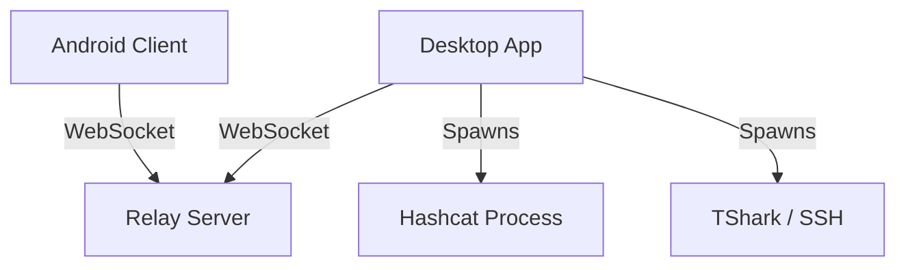

# System Architecture

Half-Hashed Kitty is a distributed system designed for WiFi security auditing and password cracking. It decouples the user interface (Android Client) from the heavy computational engine (Desktop/Hashcat), bridging them via a WebSocket Relay Server.

## High-Level Overview

The system consists of three main logical components:

1.  **Desktop Application (`hashkitty-java`)**: The core processing unit. It runs on a PC/Laptop with a GPU. It manages the `hashcat` process, hosts the Relay Server (by default), and provides a JavaFX GUI.
2.  **Relay Server**: A WebSocket-based message broker. It allows the Android client and Desktop application to communicate even if they are behind NATs or firewalls (if hosted remotely), though the default configuration runs it locally on the Desktop.
3.  **Android Client (`app`)**: A mobile remote control. It allows the user to configure and monitor attacks from their phone.



## Component Details

### 1. Desktop Application (`hashkitty-java`)
*   **Technology**: Java 17+, JavaFX 20+.
*   **Key Responsibilities**:
    *   **UI**: Provides a rich desktop interface for configuration.
    *   **Hashcat Management**: Wraps the `hashcat` executable, constructing command-line arguments and parsing stdout/stderr for progress updates.
    *   **Relay Hosting**: Includes a `ServerApp` class that starts a `RelayServer` on port 5001.
    *   **Sniffing**: Integrates with `tshark` or SSH (JSch) to capture WPA handshakes.
*   **Structure**:
    *   `hashkitty.java.App`: Main entry point and JavaFX Application.
    *   `hashkitty.java.hashcat.HashcatManager`: Handles `hashcat` process lifecycle.
    *   `hashkitty.java.server.RelayServer`: The WebSocket server implementation using `Java-WebSocket`.

### 2. Android Client (`app`)
*   **Technology**: Kotlin, Jetpack Compose.
*   **Key Responsibilities**:
    *   **Remote Control**: Sends attack configurations (hash file, mode, wordlist) to the Desktop via the Relay.
    *   **Monitoring**: Receives real-time status logs and cracked password notifications.
    *   **Scanning**: Uses a QR code scanner to quickly join a Relay room.
*   **Structure**:
    *   `MainActivity`: Host activity for Compose UI.
    *   `RelayService` (Conceptual): Handled via `WebSocketClient` in ViewModels.

### 3. Relay Server
*   **Technology**: Java (embedded in Desktop App).
*   **Protocol**: WebSocket (JSON text frames).
*   **Message Format**:
    ```json
    {
      "type": "attack",
      "roomId": "1234abcd",
      "hash": "...",
      "mode": "22000",
      "payload": "..."
    }
    ```
*   **Flow**:
    *   Clients "join" a room by sending a message or simply connecting with a `roomId`.
    *   Messages sent to a room are broadcast to all other clients in that room.

## Data Flow

### Attack Initiation
1.  **User** configures attack on Android App.
2.  **Android App** sends JSON message (`type="attack"`) to Relay Server.
3.  **Relay Server** forwards message to Desktop App (subscribed to same `roomId`).
4.  **Desktop App** parses message, validates inputs, and constructs `hashcat` command.
5.  **Desktop App** spawns `hashcat` process.

### Progress Reporting
1.  **Hashcat** outputs status line to stdout.
2.  **Desktop App** reads line, parses percentage/speed.
3.  **Desktop App** sends JSON message (`type="status"`) to Relay Server.
4.  **Relay Server** forwards to Android App.
5.  **Android App** updates progress bar/log.

## Security
*   **Configuration Export**: Connection details can be exported to `.hhk` files, which are AES-encrypted Zip archives.
*   **Network**: The Relay Server runs on HTTP/WS by default. For public deployment, it is recommended to run behind a reverse proxy (Nginx/Caddy) with SSL/TLS.
